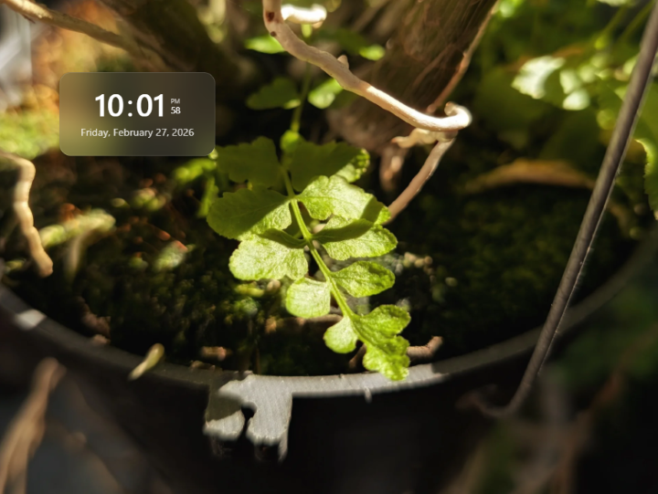

# picclock

picclock is a React web app that turns any PC, tablet, or phone into a digital photo frame with a clock overlay.



---

## Features

- Display photos from:
    - Bing Image of the Day
    - Picsum (random images)
    - Local files on your device
- Digital clock overlay
    - Static position
    - Moving around the screen (DVD-style)
- Fullscreen mode for dedicated displays

---

## Planned

- Weather display
- More customization (font, color, size...)
- More image sources:
    - Immich
    - Google Photos
    - Unsplash

---

## Tech stack

- React
- TypeScript
- Vite
- Tailwind CSS
- shadcn/ui

---

## Getting started

```bash
git clone https://github.com/tdpi95/picclock.git
cd picclock
npm install
npm run dev
```

Build:

```bash
npm run build
```

## Debugging in VSCode

Create `launch.json` in `.vscode`:

```json
{
    "version": "0.2.0",
    "configurations": [
        {
            "type": "chrome",
            "request": "launch",
            "name": "Launch Chrome against localhost",
            "url": "http://localhost:5173/picclock/",
            "webRoot": "${workspaceFolder}",
            "userDataDir": "${workspaceFolder}/.vscode/chrome-debug-profile"
        }
    ]
}
```

### Notes

- `userDataDir` keeps browser data (localStorage, IndexedDB, etc.) persistent between debug sessions
  → useful for saved settings and local photos
- If the port or path changes, update the url field
- Run `npm run dev -- --host` to expose in local network.
